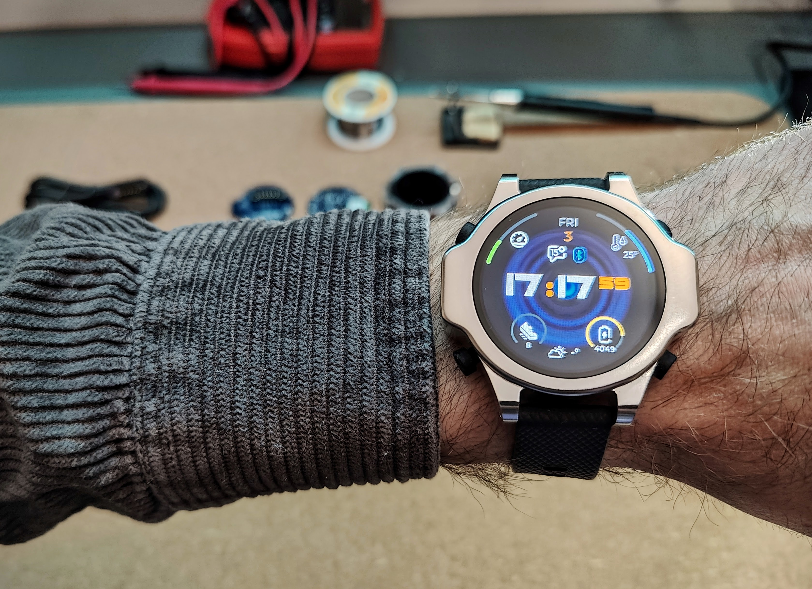
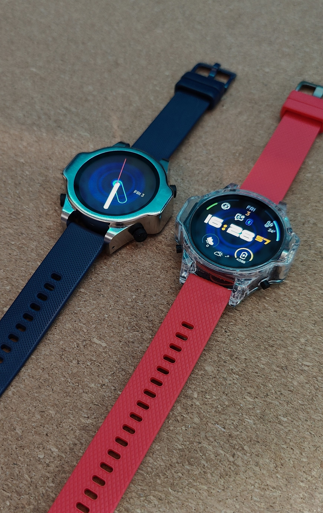
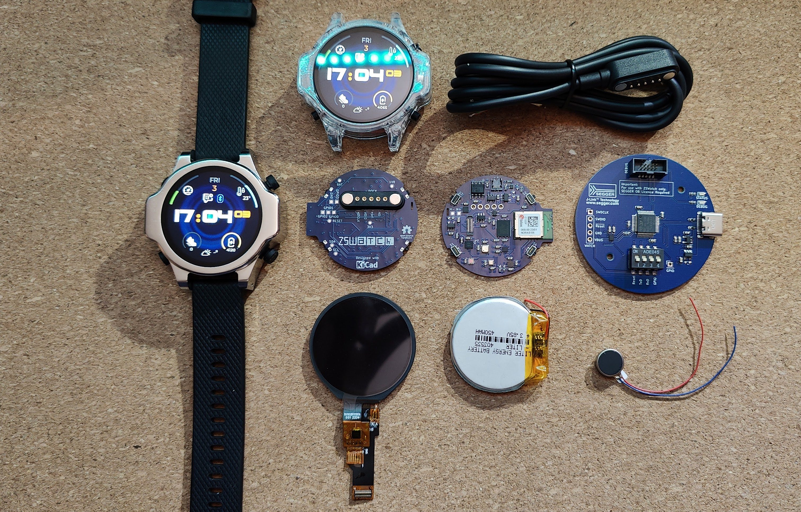
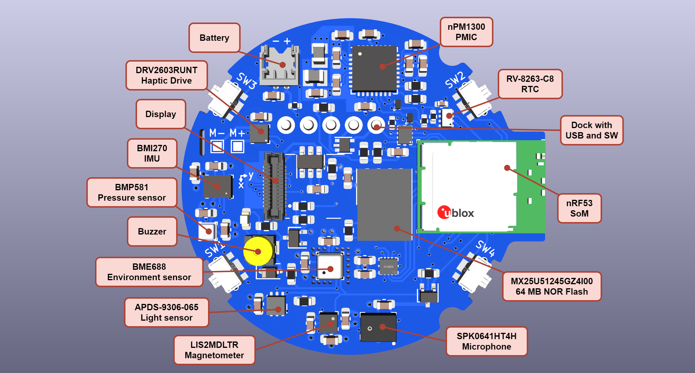
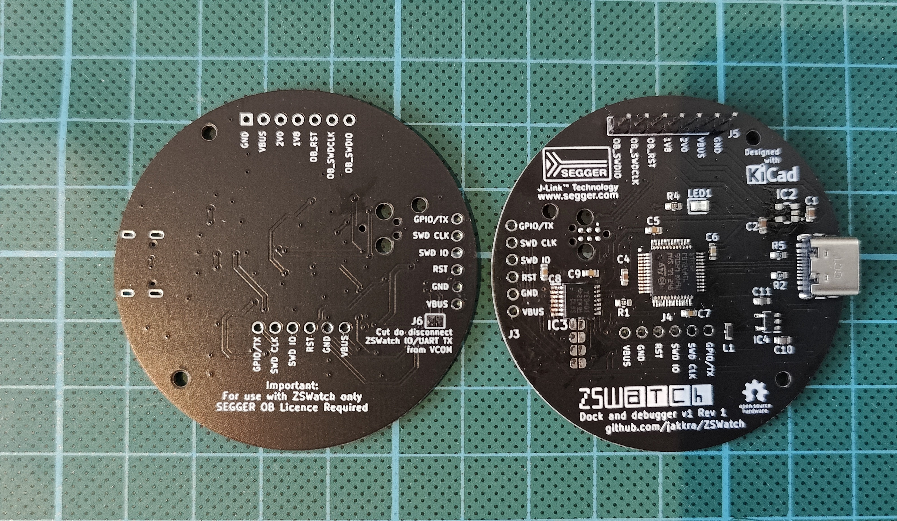
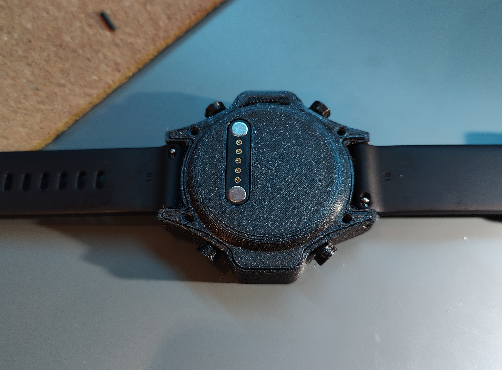
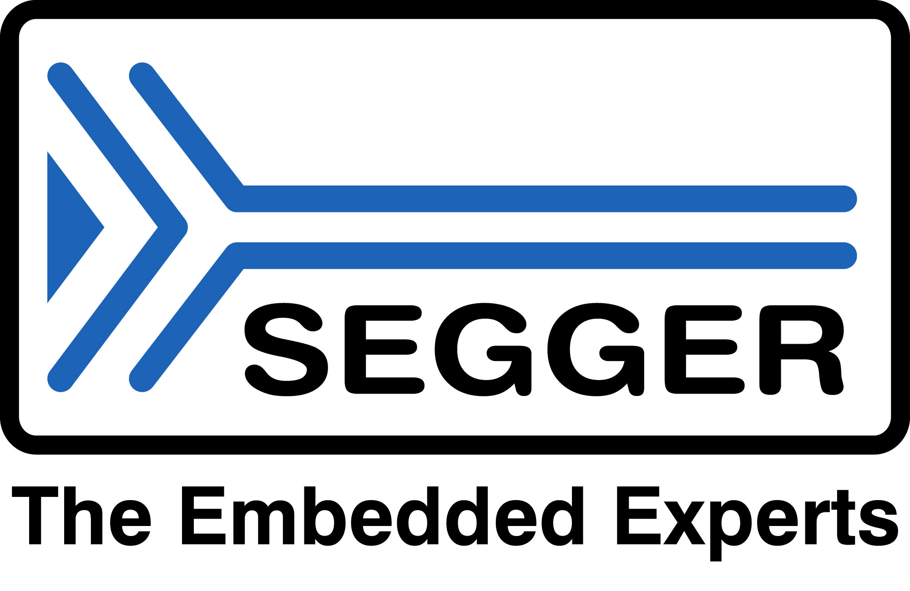

# [ZSWatch](https://zswatch.dev/)

  ZSWatch v4 CNC:ed Stainless Steel (left), Clear Resin 3D print (right)

## Table of content

- [ZSWatch](#zswatch)
  - [Table of content](#table-of-content)
  - [About](#about)
  - [Features](#features)
    - [Hardware](#hardware)
      - [PCB](#pcb)
    - [Software](#software)
    - [Watchfaces](#watchfaces)
    - [Smartphone communication](#smartphone-communication)
      - [Pairing](#pairing)
      - [Android phone communication](#android-phone-communication)
      - [iOS device communication](#ios-device-communication)
    - [Enclosure/Casing](#enclosurecasing)
    - [Upcomming features](#upcomming-features)
  - [Charger/Dock](#chargerdock)
  - [Demos](#demos)
  - [Building or getting one](#building-or-getting-one)
  - [Environment, Compiling and running the code](#environment-compiling-and-running-the-code)
  - [Writing apps for the Application Manager](#writing-apps-for-the-application-manager)
  - [Licence GPL-3.0](#licence-gpl-30)
  - [Thanks](#thanks)
  - [Miscellaneous stuff](#miscellaneous-stuff)

## About

Smartwatch built from scratch, both hardware and software. Built on the [Zephyr™ Project](https://www.zephyrproject.org/) RTOS, hence the name **ZSWatch** - *Zephyr Smartwatch*.

<kbd></kbd>

https://github.com/jakkra/ZSWatch/assets/4318648/ec1a94fd-a682-4559-9e68-f3e5bfcbe682

## Features

### Hardware

- nRF5340 BLE chip ([u-blox NORA-B10 module](https://www.u-blox.com/en/product/nora-b1-series-open-cpu))
  - 128 MHz Dual core
  - 512 KB RAM
  - 1 MB Flash
  - 30 MHz SPI for display
- [240x240 round display](https://www.buydisplay.com/240x240-round-ips-tft-lcd-display-1-28-inch-capactive-touch-circle-screen) with touch screen
- IMU [Bosch BMI270](https://www.bosch-sensortec.com/media/boschsensortec/downloads/datasheets/bst-bmi270-ds000.pdf), with this one it's possible to do many fancy things such as navigation using gestures and the typical smartwatch wakeup by moving the arm so the display is viewable
- Bosch [BME688](https://www.bosch-sensortec.com/products/environmental-sensors/gas-sensors/bme688/) Environmental sensor with AI
- Bosch [BMP581](https://www.bosch-sensortec.com/products/environmental-sensors/pressure-sensors/bmp581/) High performance pressure sensor accuracy in units of ~20cm's
- ST [LIS2MDLTR](https://www.st.com/resource/en/datasheet/lis2mdl.pdf) Magnetometer
- Macronix [MX25U51245GZ4I00](https://www.mouser.de/datasheet/2/819/MX25U51245G_2c_1_8V_2c_512Mb_2c_v1_4-3371129.pdf) 64 MB external flash
- Broadcom [APDS-9306-065](https://docs.broadcom.com/docs/AV02-4755EN) Light Sensor for automatic brightness control
- Micro Crystal [RV-8263-C8](https://www.microcrystal.com/en/products/real-time-clock-rtc-modules/rv-8263-c8) RTC for time keeping and alarm functions
- Knowles [SPK0641HT4H-1](https://www.knowles.com/docs/default-source/model-downloads/spk0641ht4h-1-rev-a.pdf) I2S microphone for audio recording
- Nordic [nPM1300](https://docs.nordicsemi.com/category/npm1300-category) PMIC for power and system management
- Texas Instruments [TS3USB221A](https://www.ti.com/lit/ds/symlink/ts3usb221a.pdf?HQS=dis-mous-null-mousermode-dsf-pf-null-wwe&ts=1695813909306&ref_url=https%253A%252F%252Feu.mouser.com%252F) USB / SWD switch to provide a USB or SWD interface on the dock connector
- Option to not mount sensors to save BOM cost

#### PCB

A 4-layer board that measures 38mm in diameter is designed in KiCad. More info [here](https://github.com/jakkra/ZSWatch-HW).

<kbd></kbd>

### Software

- Bluetooth LE communications with [GadgetBridge](https://codeberg.org/Freeyourgadget/Gadgetbridge) Android app.
- Also support Bluetooth Direction Finding so the watch can act as a tag and is trackable using any [u-blox AoA antenna board](https://www.u-blox.com/en/product/ant-b10-antenna-board)
- Multiple Watchfaces showing:
  - Standard stuff such as time, date, battery
  - Weather
  - Step count
  - Number of unread notifications
  - Environmental data
  - ...
- Pop-up notifications
- [Application picker and app concept](#writing-apps-for-the-application-manager)
  - [Setting menu system, with easy extendability](app/src/applications/settings/)
  - [Music control app](app/src/applications/music_control/)
  - [Settings app](app/src/applications/settings/)
  - [Compass app](app/src/applications/compass/)
  - etc.
- Step counting
- Gestures
- And much more
...

### Watchfaces

The watch supports different watchfaces which can be changed dynamically. The watch also supports ESP32 watchfaces from [Felix Biego](https://github.com/fbiego). Please checkout [this](https://github.com/Kampi/esp32-lvgl-watchface) fork for more informations.

### Smartphone communication

#### Pairing

- In the watch go to `Settings` -> `Bluetooth` -> `Enable pairing`
- Now go reconnect to the watch from the Gadgetbridge app
- You should now be paired

#### Android phone communication

Fortunately, there is a great Android app called [GadgetBridge](https://codeberg.org/Freeyourgadget) that handles everything needed on the phone side, such as notifications management, music control and so much more. The ZSWatch right now pretends to be one of the supported Smart Watches in Gadgetbridge, following the same API as it does. In the future there may be a point in adding native support, we'll see.

#### iOS device communication

Apple exposes [Apple Notification Center Service](https://developer.apple.com/library/archive/documentation/CoreBluetooth/Reference/AppleNotificationCenterServiceSpecification/Specification/Specification.html) GATT server which handles notifications management on the phone side, music control is done in the same fashion using [Apple Media Service](https://developer.apple.com/library/archive/documentation/CoreBluetooth/Reference/AppleMediaService_Reference/Specification/Specification.html)... The ZSWatch communicates straight to the iOS with no extra Apps.

### Enclosure/Casing

3D printed casing with 3D printed buttons, option CNC:able casing in metal.

### Upcomming features

There are almost endless possibilities for features that could be implemented, see [here for full progress](https://github.com/users/jakkra/projects/1) and in GitHub issues.

## Charger/Dock

Option with and without onboard SEGGER J-Link OB debugger. As the debugger requires a license, this will only be available as part of a kit.

See more at [here](https://github.com/jakkra/ZSWatch-Dock).

## Demos

- [HTTP requests over BLE through Gadgetbridge](https://github.com/jakkra/ZSWatch/assets/4318648/12d6e754-ceb3-4efd-9a75-d207aaeb0e82)
- [Watchfaces](https://github.com/jakkra/ZSWatch/assets/4318648/13e43401-1c00-40ab-866f-e6518e61940d)

## Building or getting one

- Head over to the hardware repos for the [PCB](https://github.com/jakkra/ZSWatch-HW) and the [Dock](https://github.com/jakkra/ZSWatch-Dock) for information about ordering the PCBs and assembly from PCBWay
- Go to the [Wiki](https://github.com/jakkra/ZSWatch/wiki/Case,-3D-printing-and-assembling) for information how to print parts and assemble ZSWatch

Some things are still in progress:

- [Building instructions in Wiki](https://github.com/jakkra/ZSWatch/wiki/Case,-3D-printing-and-assembling)
- Dock casing

If you are interested in a kit or want to get notified when the missing parts above are resolved, fill in your **[mail here](https://zswatch.dev/)** and we'll send a reminder when it's ready.

**Or** if you want to get notified for releases and when the missing parts are finished simply press the `Watch` button (next to Fork and Star) -> `Custom` -> `Releases` and you will see in your feed when it's officially released.

## Environment, Compiling and running the code

See [Wiki page about Start Developing](https://github.com/jakkra/ZSWatch/wiki/Start-Developing).

## Writing apps for the Application Manager

See [Wiki page about apps](https://github.com/jakkra/ZSWatch/wiki/Apps).

## Licence GPL-3.0

The main difference from MIT is now that if anyone wants to build something more with this, then they need to also open source their changes back to the project, which I think this is fair. This is so everyone can benefit from those improvements. If you think this is wrong free to contact me and I'm open to change the LICENCE.

## Thanks

SEGGER for supporting SEGGER-OB licenses that make the dock a fully functional programmer and debugger for ZSWatch.
Thanks to this the project will be much more approachable for persons without a J-Link debugger, letting them have full development and debugging capabilities.

## Miscellaneous stuff

- [Watch my presentation at Zephyr Developer Summit 2023](https://www.youtube.com/watch?v=MmCzV0jV9hs)
