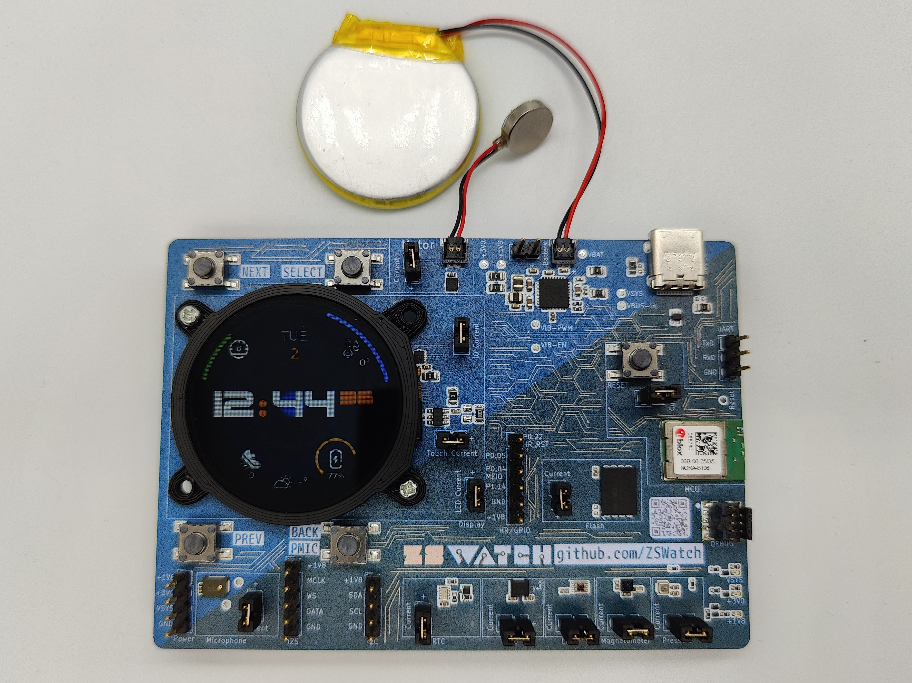

# [zswatch.dev](https://zswatch.dev/)

  ZSWatch v4 CNC:ed Stainless Steel (left), Clear Resin 3D print (right)

> **WatchDK** - The ZSWatch development kit ($99) has the same nRF5340 chip and sensors as the final watch, in a larger form factor for development and debugging. Battery optional, runs off USB-C.
>
> [Quick Start](https://zswatch.dev/docs/getting-started/watchdk-quickstart)

## About

Smartwatch built from scratch, both hardware and software. Built on the [Zephyr™ Project](https://www.zephyrproject.org/) RTOS, hence the name **ZSWatch** (*Zephyr Smartwatch*).

<kbd></kbd>

ZSWatch Development Kit (WatchDK)

https://github.com/ZSWatch/ZSWatch/assets/4318648/ec1a94fd-a682-4559-9e68-f3e5bfcbe682

## Documentation

Full documentation is available at **[zswatch.dev](https://zswatch.dev)**:

- [Getting Started](https://zswatch.dev/docs/getting-started/watchdk-quickstart) - WatchDK quick start guide
- [Toolchain & Compiling](https://zswatch.dev/docs/development/toolchain) - Environment setup, building, and flashing
- [Writing Apps](https://zswatch.dev/docs/development/writing_apps) - How to create applications for ZSWatch
- [Hardware Design](https://zswatch.dev/docs/hardware-design) - PCB design documentation

## Features

### Hardware

- nRF5340 BLE chip ([u-blox NORA-B10 module](https://www.u-blox.com/en/product/nora-b1-series-open-cpu))
  - 128 MHz Dual core
  - 512 KB RAM
  - 1 MB Flash
  - 30 MHz SPI for display
- [240x240 round display](https://www.buydisplay.com/catalog/product/view/id/1849/s/240x240-round-ips-tft-lcd-display-1-28-capacitive-touch-circle-screen/) with touch screen
- IMU [Bosch BMI270](https://www.bosch-sensortec.com/media/boschsensortec/downloads/datasheets/bst-bmi270-ds000.pdf) for gesture navigation, wrist-wake, step counting
- Bosch [BMP581](https://www.bosch-sensortec.com/products/environmental-sensors/pressure-sensors/bmp581/) High-performance pressure sensor (~20 cm accuracy)
- ST [LIS2MDLTR](https://www.st.com/resource/en/datasheet/lis2mdl.pdf) Magnetometer
- Macronix [MX25U51245GZ4I00](https://www.mouser.de/datasheet/2/819/MX25U51245G_2c_1_8V_2c_512Mb_2c_v1_4-3371129.pdf) 64 MB external flash
- Broadcom [APDS-9306-065](https://docs.broadcom.com/docs/AV02-4755EN) Light Sensor for automatic brightness control
- Micro Crystal [RV-8263-C8](https://www.microcrystal.com/en/products/real-time-clock-rtc-modules/rv-8263-c8) RTC for time keeping and alarm functions
- Knowles [SPK0641HT4H-1](https://www.knowles.com/docs/default-source/model-downloads/spk0641ht4h-1-rev-a.pdf) I2S microphone for audio recording
- Nordic [nPM1300](https://docs.nordicsemi.com/category/npm1300-category) PMIC for power and system management
- Speaker (Requires HR Extension Board)

#### PCB

All hardware is designed in KiCad. Hardware repos:

- [Watch PCB](https://github.com/ZSWatch/Watch-HW) - 38 mm diameter watch PCB
- [Watch DevKit PCB](https://github.com/ZSWatch/Watch-DevKit-HW) - Larger development board with breakout headers and debug header
- [Extension PCB](https://github.com/ZSWatch/Extension-HW) - Health and audio addon PCB
- [Dock/Breakout PCB](https://github.com/ZSWatch/Dock-HW) - USB-C breakout for debugger and UART access

<kbd></kbd>
#### HR Extension Board (WIP)

The Extension PCB is a small add-on board (approximately 16.8 mm diameter) that plugs into the WatchDK headers. It is still in development and the design, BOM, and firmware support may change.

More background and progress updates:
- https://zswatch.dev/blog/dk-and-hr-integration
- https://zswatch.dev/blog/progress-hw-xip-usb-power
- https://zswatch.dev/blog/progress-hr-fota

Key BOM highlights:
- Analog Devices / Maxim `MAX86141` optical AFE + ams OSRAM `SFH 7016` (RGB/IR LED module) + Vishay `VEMD8082` photodiodes
- Analog Devices / Maxim `MAX32664` biometric sensor hub
- Renesas / Dialog `DA7212` audio codec (speaker support)
- Amphenol `101P014FB110` board-to-board connectors

### Software

- Bluetooth LE communications with [GadgetBridge](https://codeberg.org/Freeyourgadget/Gadgetbridge) (Android) and Apple ANCS/AMS (iOS)
- Multiple watchfaces (dynamically switchable), showing time, date, battery, weather, steps, notifications, environmental data, and more
- Pop-up notifications
- Application picker with extensible app framework
  - [Settings](app/src/applications/settings/), [Music control](app/src/applications/music_control/), [Compass](app/src/applications/compass/), and many more
- Step counting, gestures, and much more

The watch also supports ESP32 watchfaces from [Felix Biego](https://github.com/fbiego). See [this fork](https://github.com/Kampi/esp32-lvgl-watchface) for details.

### Smartphone Communication

**Android:** Uses [GadgetBridge](https://codeberg.org/Freeyourgadget/Gadgetbridge) for notifications, music control, weather, and more.

**iOS:** Communicates directly via [Apple Notification Center Service](https://developer.apple.com/library/archive/documentation/CoreBluetooth/Reference/AppleNotificationCenterServiceSpecification/Specification/Specification.html) and [Apple Media Service](https://developer.apple.com/library/archive/documentation/CoreBluetooth/Reference/AppleMediaService_Reference/Specification/Specification.html). No extra apps needed.

See [phone setup on zswatch.dev](https://zswatch.dev/docs/getting-started/phone_setup) for details.

### Enclosure/Casing

3D-printed casing with 3D-printed buttons, with an option for CNC:ed metal casing.

## Getting a WatchDK or Building Your Own

**For development:** The [WatchDK](https://zswatch.dev/docs/getting-started/watchdk-quickstart) ($99) is the recommended starting point. It has the same nRF5340 SoC, sensors, and display as the final watch, with breakout headers, USB-C with SWD/UART, power measurement headers, and a debug header. Everything except battery is included. Battery is optional.

**For DIY builders:** Head over to the hardware repos for the for ordering information. The final miniature watch hardware is still being developed.

## Demos

- [HTTP requests over BLE through Gadgetbridge](https://github.com/ZSWatch/ZSWatch/assets/4318648/12d6e754-ceb3-4efd-9a75-d207aaeb0e82)
- [Watchfaces](https://github.com/ZSWatch/ZSWatch/assets/4318648/13e43401-1c00-40ab-866f-e6518e61940d)

## Developing

See the [Toolchain & Build Guide](https://zswatch.dev/docs/development/toolchain) for environment setup, compiling, and flashing.

To learn how to write apps for ZSWatch, see [Writing Apps](https://zswatch.dev/docs/development/writing_apps).

## Licence GPL-3.0

The main difference from MIT is that if anyone wants to build something more with this, they need to also open source their changes back to the project, which I think is fair, so everyone can benefit from those improvements. If you think this is wrong, feel free to contact me and I'm open to change the licence.

## Thanks

### Funding

This project is partly funded through [NGI0 Commons Fund](https://nlnet.nl/commonsfund), a fund established by [NLnet](https://nlnet.nl) with financial support from the European Commission's [Next Generation Internet](https://ngi.eu) program. Learn more at the [NLnet project page](https://nlnet.nl/project/ZSWatch).

### Support

  
  

**PCBWay** for sponsoring the manufacturing and assembly of prototype PCBs. PCBWay is the recommended manufacturer for PCBs and assembly of ZSWatch.

## Miscellaneous

- [Watch my presentation at Zephyr Developer Summit 2023](https://www.youtube.com/watch?v=MmCzV0jV9hs)
