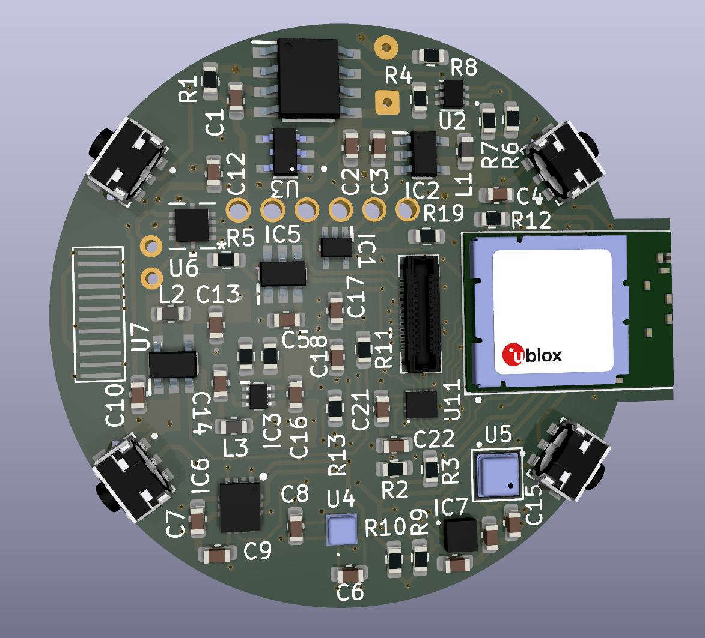
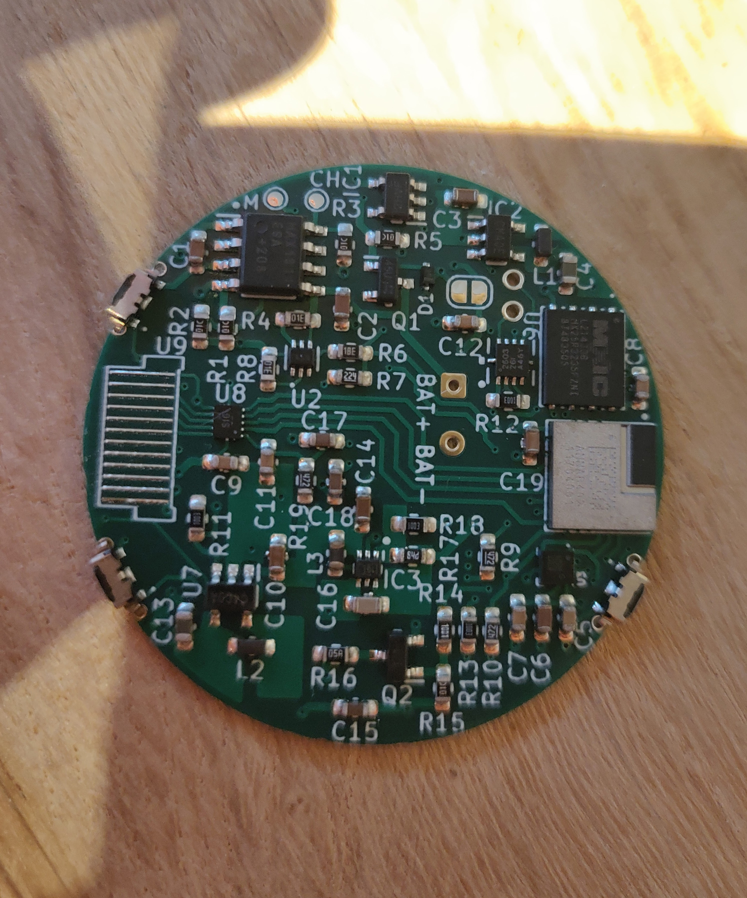
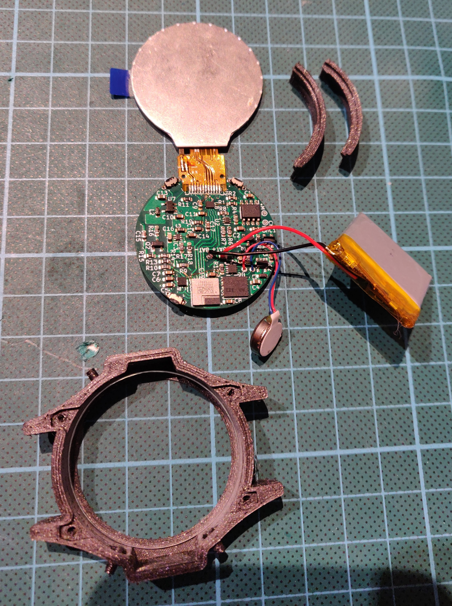

  <h1>ZSWatch</h1>
  

  The ZSWatch v1

 

Smartwatch built from scratch, both hardware and software. Built on the [Zephyr™ Project](https://www.zephyrproject.org/) RTOS, hence the name **ZSWatch** - *Zephyr Smartwatch*.
 

## Building or getting one
I have received quite some requests regarding building or getting the ZSWatch, I suggest to wait for the v2 version I'm working on. If you want to get notified when I'm done with v2 then simply press the `Watch` button (next to Fork and Star) -> `Custom -> Releases` and you will see in your feed when it's released.
 
 
**Or** you can fill in your **[mail here (Google form)](https://forms.gle/G48Sm5zDe9aCaYtT9)** and I'll send a reminder when it's ready (or if I decide to make a few kits, who knows).
 
## Hardware Features in ZSWatch v1
- nRF52833 BLE chip [(u-blox ANNA-B402 module)](https://content.u-blox.com/sites/default/files/ANNA-B402_DataSheet_UBX-20032372.pdf).
- 1.28" 240x240 IPS TFT Circular Display with [GC9A01 driver](https://www.buydisplay.com/1-28-inch-tft-lcd-display-240x240-round-circle-screen-for-smart-watch).
- Accelerometer for step counting etc. [(LIS2DS12TR)](https://www.st.com/content/ccc/resource/technical/document/datasheet/ce/32/55/ac/e1/87/46/84/DM00177048.pdf/files/DM00177048.pdf/jcr:content/translations/en.DM00177048.pdf).
- Pulse oximetry and heartrate using [(MAX30101EFD)](https://datasheets.maximintegrated.com/en/ds/MAX30101.pdf)).
- Vibration motor with haptics driver to give better vibration control [(DRV2603RUNT)](https://www.ti.com/lit/ds/symlink/drv2603.pdf?HQS=dis-dk-null-digikeymode-dsf-pf-null-wwe&ts=1662847620221).
- External 8MB flash [(MX25R6435FZNIL0)](https://static6.arrow.com/aropdfconversion/a35c4dff799e6b2e44732bd665796d74a8a3f62a/244684669660894mx25r6435f20wide20range2064mb20v1..pdf).
- Battery charger and battery supervisor ([MAX1811ESA+ datasheet](https://datasheets.maximintegrated.com/en/ds/MAX1811.pdf), [TLV840MAPL3](https://www.ti.com/lit/ds/symlink/tlv840-q1.pdf?ts=1662823963602&ref_url=https%253A%252F%252Fwww.ti.com%252Fpower-management%252Fsupervisor-reset-ic%252Fproducts.html)).
- 3 buttons for navigation (prev/next/enter)
- 220 mAh Li-Po battery.
- Sapphire Crystal Glass to protect the display.

### BOM
Found [here](ZSWatch-kicad/zswatch-bom.csv)

### PCB Issues in v1
**Do not build the v1, wait for v2.**

- Logic level converter pinout shifted, requires manual PCB rework.
- Possible current leakage on some pins.
- Max display brightness is 60% (however definitely bright enough).

## Hardware features in ZSWatch v2
- nRF5340 BLE chip (u-blox NORA-B10 module).
  - 2x CPU frequenzy.
  - 4x RAM (Will allow double buffered of data to the screen and larger framebuffers to decrease lag/tearing).
  - 2x Flash.
  - 6x faster display communication (8-> 30 MHz), should improve lag/tearing.
- **Touch screen** with [same size and features as v1](https://www.buydisplay.com/240x240-round-ips-tft-lcd-display-1-28-inch-capactive-touch-circle-screen)
- Replace LIS2DS12TR accelerometer with a more modern and feature rich IMU [Bosch BMI270](https://www.bosch-sensortec.com/media/boschsensortec/downloads/datasheets/bst-bmi270-ds000.pdf), with this one it's possible to do many fancy things such as navigation using gestures and the typical smartwatch wakeup by moving the arm so the display is viewable.
- Bosch [BME688](https://www.bosch-sensortec.com/products/environmental-sensors/gas-sensors/bme688/) Environmental sensing with AI.
- ST [LIS2MDLTR](https://www.st.com/resource/en/datasheet/lis2mdl.pdf) Magnetometer.
- [Magnetic 6 pin connector](https://www.aliexpress.com/item/1005002776015559.html?) for charging and programming which connects to a new dock/adapter.
- Option to make the watch cheaper by using the v1 display without touch.
- Option to not mount some sensors to save BOM cost.
- 8MB external flash is removed due to larger size of u-blox NORA-B10 vs. ANNA-B402, however plenty of flash in new MCU.

## Progress on v2
[Schematic for v2](schematic/ZSWatch-v2-kicad.pdf) is uploaded and should be pretty much final.
 
PCB are finished, ordered and sucessfully assembled. Everyhting works except I2C communication with touch screen due to the logic lever converter chip. Will fix this and some other minor things for next revision.

You can follow the progress here [https://github.com/users/jakkra/projects/1/views/5](https://github.com/users/jakkra/projects/1/views/5)

## Charger/Dock
Basic pogo-pin dock that connects the power and SWD pins to the bottom of the watch. Will be replaced for v2 with a much better solution. For the v2. dock variant I have not yet figured out how to best connect it to the watch, all connectors I found online are to thick, for example [Magnetic 6 pin connector](https://www.aliexpress.com/item/1005002776015559.html?).

## Enclosure/Casing
3D printed casing with 3D printed buttons. Does it's job, but for revision v2 of the watch I'll probably do something CNC'd for nicer looks.

## Software Features
- Bluetooth LE communications with [GadgetBridge](https://codeberg.org/Freeyourgadget/Gadgetbridge) Android app.
- Also support Bluetooth Direction Finding so the watch can act as a tag and is trackable using any [u-blox AoA antenna board](https://www.u-blox.com/en/product/ant-b10-antenna-board)
- Watchface that shows:
   - Standard stuff as time, date, battery
   - Weather
   - Step count
   - Number unread notifications
   - Heart rate (not implemented yet however)
- Pop-up notifications
- Setting menu system, with easy extendability
- [Application picker and app concept](#writing-apps-for-the-application-manager)
   - [Music control app](app/src/applications/music_control/)
   - [Settings app](app/src/applications/settings/)
   - etc.
- Step counting

### Larger not yet implemented SW Features and TODOs
- Heart rate, right now only samples the raw data, but no heart rate is calculated from it.
- Proper BLE pairing, currently removed due to flash constraints (fixed by nRF5340 upgrade).
- Watchface should also be an application.
- Use the new sensors in ZSWatch v2 for some really cool new features.

## Android phone communication
Fortunately there is a great Android app called [GadgetBridge](https://codeberg.org/Freeyourgadget) which handles everything needed on the phone side, such as notifications management, music control and so much more... The ZSWatch right now pretends to be one of the supported Smart Watches in Gadgetbridge, following the same API as it does. In future there may be a point adding native support, we'll see.

## PCB
A 4 layer board which measures 36mm in diameter designed in KiCad.

## ZSWatch in action
|*Music control*|*Accelerometer for step count and tap detection*|
|---|---|
|   |   |
|*Notifications from phone (Gmail here)*|*Settings*|
|      |   |

## Writing apps for the Application Manager
Check out [the sample application](app/src/applications/template/) for the general app design. The main idea is each app have an `<app_name>_app.c` file which registers the app, chooses icon and drives the logic for the app. Then there should be one or more files named for example `<app_name>_ui.c` containing pure LVGL code with no dependencies to Zephyr or the watch software. The idea is that this UI code should be runnable in a LVGL simulator to speed up development of UI, however right now that's not set up yet. The `<app_name>_app.c` will do all logic and call functions in `<app_name>_ui.c` to update the UI accordingly. 

Each application needs to have a way to close itself, for example a button, and then through callback tell the `application_manager.c` to close the app:

When user clicks an app in the app picker:
- `application_manager.c` deletes it's UI elements and calls the `application_start_fn`.
- `<app_name>_app.c` will do necessary init and then call the `<app_name>_ui.c` to draw the app UI.
- User can now navigate arund and the application and do whatever.

When user for example presses a close button in the application:
- Typically a callback from the UI code in `<app_name>_ui.c` will call `<app_name>_app.c` to tell that user requested to close the app. `<app_name>_app.c` will notify `application_manager.c` that it want to close itself. `application_manager.c` will then call `<app_name>_app.c` `application_stop_fn` and `<app_name>_app.c` will tell UI to close then do necessary de-init and return.
- `application_manager.c` will now draw the app picker again.

The application manager can also at any time close a running application by calling it's `application_stop_fn`.

## Dock
Very basic, will be re-worked for next watch revision v2.

## Licence GPL-3.0
Main difference from MIT is now that if anyone want to build something more with this, then they need to also open source their changes back to the project, which I thinks is fair. This is so everyone can benefit from those improvements. If you think this is wrong for some reason feel free to contact me, I'm open to change the LICENCE.