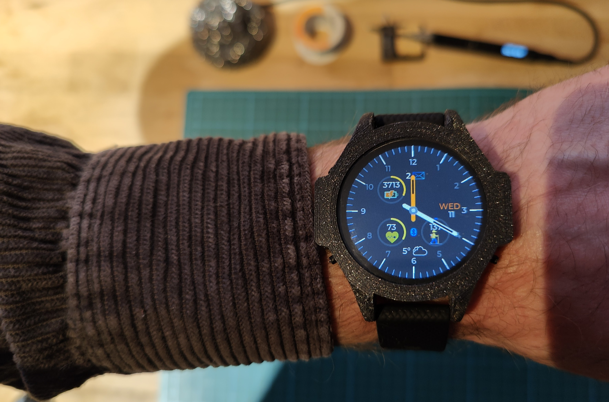
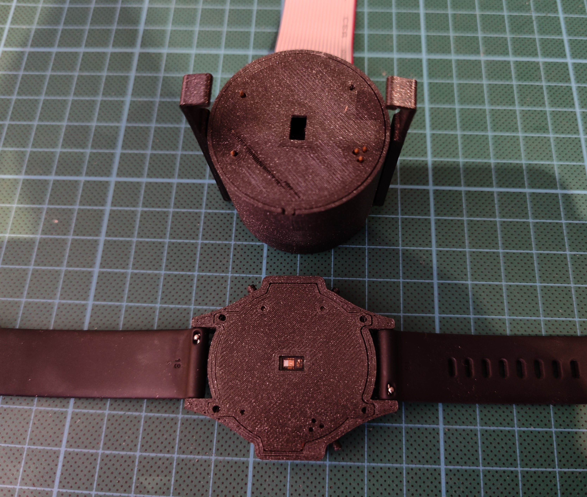
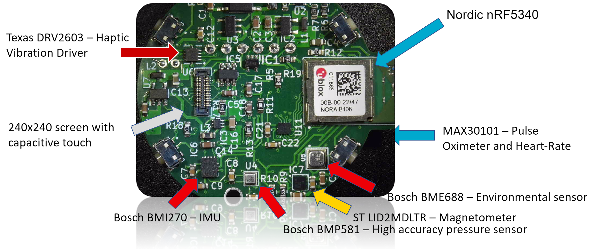
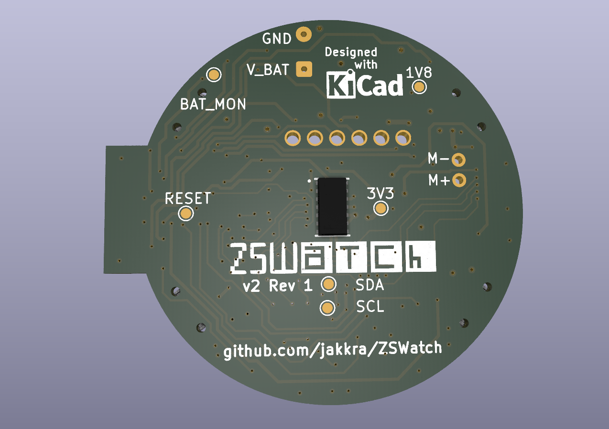

  <h1>ZSWatch</h1>

  ZSWatch v2

 
 

Smartwatch built from scratch, both hardware and software. Built on the [Zephyr™ Project](https://www.zephyrproject.org/) RTOS, hence the name **ZSWatch** - *Zephyr Smartwatch*.
 

<kbd></kbd> 

<kbd></kbd> 

**Synced remote control over BLE**

[https://user-images.githubusercontent.com/64562059/234390129-321d4f35-cb4b-45e8-89d9-20ae292f34fc.mp4](https://github.com/jakkra/ZSWatch/assets/4318648/8d0f40c2-d519-4db1-8634-b43caa502cbe)

  

Watch my presentation at Zephyr Developer Summit 2023

## Building or getting one
I have received quite some requests regarding building or getting the ZSWatch, the hardware is done and you can now build it yourself. However I may do some smaller changes before I call it done and officially "release" it. If you want to get notified when I'm "releasing" it, then simply press the `Watch` button (next to Fork and Star) -> `Custom -> Releases` and you will see in your feed when it's released.
 
**Or** you can fill in your **[mail here (Google form)](https://forms.gle/G48Sm5zDe9aCaYtT9)** and I'll send a reminder when it's ready (or if I decide to make a few kits, who knows).
 

# Table of content ZSWatch
- [Building or getting one](#building-or-getting-one)
- [Hardware features](#hardware-features)
- [Charger/Dock](#chargerdock)
- [Enclosure/Casing](#enclosurecasing)
- [Software Features](#software-features)
  * [Larger not yet implemented SW Features and TODOs](#larger-not-yet-implemented-sw-features-and-todos)
- [Android phone communication](#android-phone-communication)
  * [Pairing](#pairing)
- [PCB](#pcb)
- [ZSWatch v1 in action (Note old, not updated for latest HW and SW).](#zswatch-v1-in-action-note-old-not-updated-for-latest-hw-and-sw)
- [Environment, Compiling and running the code](GETTING_STARTED.md)
- [Writing apps for the Application Manager](#writing-apps-for-the-application-manager)
- [Other tools](#other-tools)
- [Licence GPL-3.0](#licence-gpl-30)

## Hardware features
- nRF5340 BLE chip (u-blox NORA-B10 module).
  - 128 MHz Dual core.
  - 512 KB RAM.
  - 1 MB Flash.
  - 30 MHz SPI for display.
- [240x240 round display](https://www.buydisplay.com/240x240-round-ips-tft-lcd-display-1-28-inch-capactive-touch-circle-screen) with touch screen.
- IMU [Bosch BMI270](https://www.bosch-sensortec.com/media/boschsensortec/downloads/datasheets/bst-bmi270-ds000.pdf), with this one it's possible to do many fancy things such as navigation using gestures and the typical smartwatch wakeup by moving the arm so the display is viewable.
- Bosch [BME688](https://www.bosch-sensortec.com/products/environmental-sensors/gas-sensors/bme688/) Environmental sensor with AI.
- Bosch [BMP581](https://www.bosch-sensortec.com/products/environmental-sensors/pressure-sensors/bmp581/) High performance pressure sensor accuracy in units of ~20cm's.
- ST [LIS2MDLTR](https://www.st.com/resource/en/datasheet/lis2mdl.pdf) Magnetometer.
- Analog Devices [MAX30101](https://www.analog.com/en/products/max30101.html) Heart-Rate Monitor and Pulse Oximeter Sensor.
- Option to not mount some sensors to save BOM cost.

## Charger/Dock
PCB done, casing to be designed. Idea is that watch will sit on top.
Built in debugger. Will be an option without debugger also  (requires licence).

## Enclosure/Casing
3D printed casing with 3D printed buttons. Does it's job, but would like to do something else, maybe CNC. Buttons are not 100% perfect right now.

## Software Features
- Bluetooth LE communications with [GadgetBridge](https://codeberg.org/Freeyourgadget/Gadgetbridge) Android app.
- Also support Bluetooth Direction Finding so the watch can act as a tag and is trackable using any [u-blox AoA antenna board](https://www.u-blox.com/en/product/ant-b10-antenna-board)
- Watchface that shows:
   - Standard stuff as time, date, battery
   - Weather
   - Step count
   - Number unread notifications
   - Heart rate (not implemented yet however)
   - ...
- Pop-up notifications
- [Application picker and app concept](#writing-apps-for-the-application-manager)
   - [Setting menu system, with easy extendability](app/src/applications/settings/)
   - [Music control app](app/src/applications/music_control/)
   - [Settings app](app/src/applications/settings/)
   - [Compass app](app/src/applications/compass/)
   - etc.
- Step counting
- Gestures
- And much more
...

### Features and progress
There are almost endless of posiblities for features that could be implemented, see [here for full progress](https://github.com/users/jakkra/projects/1) and my current ideas.

## Android phone communication
Fortunately there is a great Android app called [GadgetBridge](https://codeberg.org/Freeyourgadget) which handles everything needed on the phone side, such as notifications management, music control and so much more... The ZSWatch right now pretends to be one of the supported Smart Watches in Gadgetbridge, following the same API as it does. In future there may be a point adding native support, we'll see.

### Pairing
- In the watch go to Settings -> Bluetooth -> Enable pairing
- Now go reconnect to the watch from Gadgetbridge app.
- You should now be paired.

## PCB
A 4 layer board which measures 38mm in diameter designed in KiCad.

## ZSWatch v1 in action (Note old, not updated for latest HW and SW).
|*Music control*|*Accelerometer for step count and tap detection*|
|---|---|
|   |   |
|*Notifications from phone (Gmail here)*|*Settings*|
|      |   |

https://github.com/jakkra/ZSWatch/assets/4318648/8d8ec724-8145-4a30-b241-e69a8c2853bf

## Environment, Compiling and running the code
See [GETTING_STARTED.md](GETTING_STARTED.md)

## Writing apps for the Application Manager
I recommend watching [this part](https://youtu.be/MmCzV0jV9hs?t=1398) of my presentation at Zephyr Developer Summit where I build a sample app.

Check out [the sample application](app/src/applications/template/) for the general app design. The main idea is each app have an `<app_name>_app.c` file which registers the app, chooses icon and drives the logic for the app. Then there should be one or more files named for example `<app_name>_ui.c` containing pure LVGL code with no dependencies to Zephyr or the watch software. The idea is that this UI code should be runnable in a LVGL simulator to speed up development of UI, however right now that's not set up yet. The `<app_name>_app.c` will do all logic and call functions in `<app_name>_ui.c` to update the UI accordingly. 

Each application needs to have a way to close itself, for example a button, and then through callback tell the `application_manager.c` to close the app:

When user clicks an app in the app picker:
- `application_manager.c` deletes it's UI elements and calls the `application_start_fn`.
- `<app_name>_app.c` will do necessary init and then call the `<app_name>_ui.c` to draw the app UI.
- User can now navigate arund and the application and do whatever.

When user for example presses a close button in the application:
- Typically a callback from the UI code in `<app_name>_ui.c` will call `<app_name>_app.c` to tell that user requested to close the app. `<app_name>_app.c` will notify `application_manager.c` that it want to close itself. `application_manager.c` will then call `<app_name>_app.c` `application_stop_fn` and `<app_name>_app.c` will tell UI to close then do necessary de-init and return.
- `application_manager.c` will now draw the app picker again.

The application manager can also at any time close a running application by calling it's `application_stop_fn`.

## Other tools
- Visit https://jakkra.github.io/ZSWatch-Web-Dashboard to connect and view sensor data in a browser that supports Web Bluetooth [(Source code)](https://github.com/jakkra/ZSWatch-Web-Dashboard 
)

## Licence GPL-3.0
Main difference from MIT is now that if anyone want to build something more with this, then they need to also open source their changes back to the project, which I thinks is fair. This is so everyone can benefit from those improvements. If you think this is wrong for some reason feel free to contact me, I'm open to change the LICENCE.
