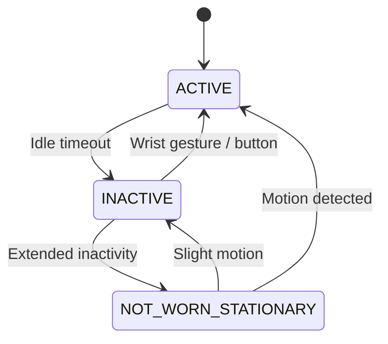

import ZoomableMermaid from '@site/src/components/ZoomableMermaid';

# Architecture Overview

## Overview

ZSWatch is built on an **event-driven architecture** powered by Zephyr's [zbus](https://docs.zephyrproject.org/latest/services/zbus/index.html) publish/subscribe messaging system. Rather than tight coupling between modules, sensors, BLE services, managers, and applications communicate through named **channels**. Each module publishes data to a channel and any number of listeners can subscribe, making the system modular and easy to extend.

The main architectural layers are:

- **Sensors** - read hardware and publish data to zbus channels
- **BLE services** - receive data from the phone and publish to zbus; subscribe to channels to send data back
- **Managers** - orchestrate system behavior (app lifecycle, power states, notifications)
- **Applications** - subscribe to relevant channels and render UI via LVGL

## System Block Diagram

Click the diagram (or open the zoomable view) to pan and zoom.

<ZoomableMermaid
  title="System Block Diagram"
  value={`
graph LR
    subgraph Sensors
        direction TB
        IMU[IMU]
        MAG[Magnetometer]
        PRESS[Pressure]
        ENV[Environment]
        LIGHT[Light]
        BAT[Battery]
    end

    subgraph Phone
        direction TB
        GB[GadgetBridge<br/>Android]
        ANCS[ANCS / AMS<br/>iOS]
    end

    subgraph Bus["Zbus"]
        direction TB
        SENSOR_CH[Sensor channels]
        BLE_CH[ble_comm_data_chan]
        MUSIC_CH[music_control_data_chan]
        ACTIVITY_CH[activity_state_data_chan]
        NOTIF_CH[notification_mgr_chan]
        PERIODIC[Periodic timers<br/>100ms / 1s / 10s]
    end

    subgraph Core["Managers"]
        direction TB
        PM[Power Manager]
        AM[App Manager]
        NM[Notification Manager]
    end

    subgraph UI["Apps"]
        direction TB
        WF[Watchface]
        MUSIC[Music Control]
        COMPASS[Compass]
        OTHER[Other Apps]
    end

    Sensors --> SENSOR_CH
    PERIODIC --> Sensors

    Phone --> BLE_CH
    MUSIC_CH --> Phone

    BLE_CH --> NM
    BLE_CH --> WF
    BLE_CH --> MUSIC
    NM --> NOTIF_CH --> WF

    SENSOR_CH --> WF
    SENSOR_CH --> COMPASS
    SENSOR_CH --> OTHER

    PM --> ACTIVITY_CH --> AM
    AM -->|start / stop| UI
`}
/>

## Event System (Zbus)

ZSWatch uses Zephyr's **zbus** for all inter-module communication. Modules publish typed structs to named channels, and any number of listeners or subscribers receive them asynchronously.

Key rules:
- **Listeners run in the publisher's context** (often a BLE or sensor thread with limited stack). Always use `k_work_submit()` for non-trivial processing.
- **Channels are typed**: each carries a specific struct (e.g., `struct accel_data_event`).
- **Decoupled**: publishers don't know who listens; listeners don't know who publishes.

### Channel Reference

| Channel | Data | Direction | Description |
|---------|------|-----------|-------------|
| `accel_data_chan` | Gesture/accel events | Sensor → Apps | IMU interrupt-driven events (tap, tilt, step) |
| `activity_state_data_chan` | Power state enum | Power Mgr → App Mgr | ACTIVE / INACTIVE / NOT_WORN_STATIONARY |
| `battery_sample_data_chan` | mV, %, temp, charging | Sensor → Apps | Battery status updates |
| `ble_comm_data_chan` | Typed BLE payload | BLE → Apps | Notifications, music info, weather, time, etc. |
| `environment_data_chan` | Temp, humidity, pressure, IAQ | Sensor → Apps | Environmental sensor readings |
| `light_data_chan` | Lux value | Sensor → Apps | Ambient light level |
| `magnetometer_data_chan` | x/y/z components | Sensor → Apps | Magnetometer heading data |
| `music_control_data_chan` | Play/pause/next/prev | App → BLE | Music UI commands sent to phone |
| `pressure_data_chan` | Pressure, temperature | Sensor → Apps | Barometric pressure readings |
| `periodic_event_100ms_chan` | Tick | Timer → Subscribers | 100 ms periodic event |
| `periodic_event_1s_chan` | Tick | Timer → Subscribers | 1-second periodic event |
| `periodic_event_10s_chan` | Tick | Timer → Subscribers | 10-second periodic event |
| `zsw_notification_mgr_chan` | Notification | Notif Mgr → Apps | New notification received |
| `zsw_notification_mgr_remove_chan` | Notification ID | Notif Mgr → Apps | Notification dismissed/removed |

## Periodic Events

The system provides three shared periodic timer channels: **100 ms**, **1 s**, and **10 s**. These drive most recurring work: sensor polling, UI refresh, battery sampling, etc.

Periodic channels use a **lazy start/stop** mechanism: the timer only runs when at least one observer is registered. Apps subscribe when they start and unsubscribe when they stop, so idle apps don't waste power.

```c
// Subscribe to 1-second ticks (e.g., in app start_func)
zsw_periodic_chan_add_obs(&periodic_event_1s_chan, &my_listener);

// Unsubscribe (e.g., in app stop_func)
zsw_periodic_chan_rm_obs(&periodic_event_1s_chan, &my_listener);
```

Typical usage: a watchface subscribes to `periodic_event_1s_chan` to update the clock, and to `periodic_event_10s_chan` for refreshing weather or battery status.

## Sensor Data Flow

The sensor data pipeline is straightforward:

1. A **periodic event** (1 s or 10 s) fires
2. Sensor drivers **read hardware** and **publish** to their zbus channel
3. Apps/watchfaces that have **subscribed** receive the data in their listener callback
4. The listener schedules a **work item** to update the UI on the main thread

```
Periodic Timer → Sensor Driver → zbus channel → App Listener → k_work → UI Update
```

Sensor modules (IMU, magnetometer, pressure, environment, light) are abstracted behind simple APIs in `app/src/sensors/`. The IMU is an exception: it is primarily **interrupt-driven** (gestures, step events) rather than polled.

## BLE Communication

ZSWatch supports two phone platforms through different BLE profiles:

| Platform | Protocol | Services |
|----------|----------|----------|
| **Android** | GadgetBridge JSON | Notifications, music, weather, time, calls, navigation |
| **iOS** | Apple ANCS + AMS + CTS | Notifications (ANCS), media control (AMS), time (CTS) |

Incoming BLE data is parsed and published to `ble_comm_data_chan` with a **type field**. Consumers filter by type:

- **Notification Manager** - handles notification types, stores up to 10
- **Music app** - handles music info/state types
- **Watchface** - handles weather and time types

Outbound commands (e.g., music play/pause) flow in reverse: the app publishes to `music_control_data_chan`, and the BLE module picks it up and sends it to the phone.

## Power Management

The power manager tracks user activity and drives the display and app lifecycle through three states:



| State | Display | Apps | Description |
|-------|---------|------|-------------|
| **ACTIVE** | On | `UI_VISIBLE` | User is interacting with the watch |
| **INACTIVE** | Off | `UI_HIDDEN` | Idle timeout elapsed; screen off to save power |
| **NOT_WORN_STATIONARY** | Off | `UI_HIDDEN` | Watch not being worn; deeper power saving |

State changes are published to `activity_state_data_chan`. The **App Manager** reacts by calling each app's `ui_unavailable_func` / `ui_available_func` callbacks, so apps can pause UI updates when the screen is off.

:::tip
Always guard UI updates with a state check:
```c
if (app.current_state == ZSW_APP_STATE_UI_VISIBLE) {
    // Safe to update LVGL objects
}
```
:::

---

For details on building apps that use this architecture, see the [Writing Apps](./writing_apps.md) guide.
