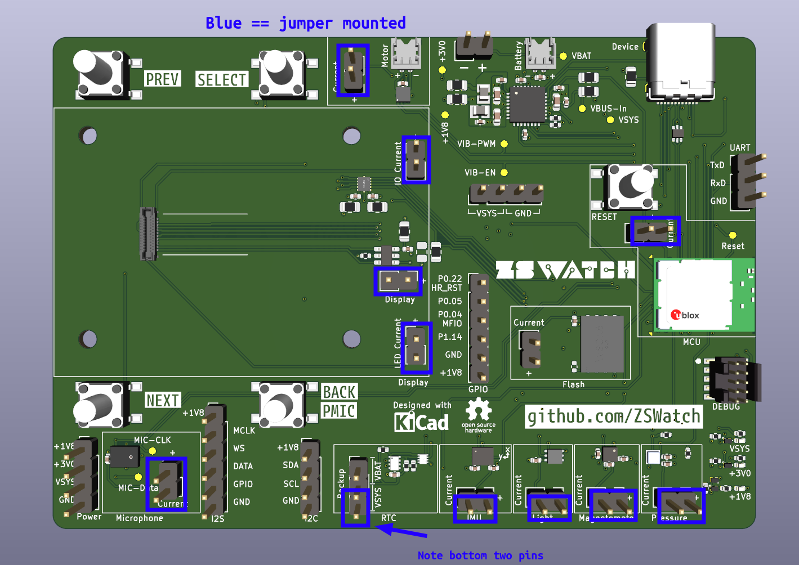

# WatchDK Quick Start

This guide walks you through setting up your **ZSWatch Development Kit (WatchDK)** for the first time - from powering on to having a fully working smartwatch UI with icons and images.

import Tabs from '@theme/Tabs';
import TabItem from '@theme/TabItem';

## What You Need

| Item | Required? | Notes |
|------|-----------|-------|
| **USB-C cable** | Yes | For power and optional USB firmware updates |
| **WatchDK** (with display & vibration motor connected) | Yes | Ships assembled and tested with display & motor pre-connected |
| **Debugger** (recommended: Nordic **nRF54L15 DK**, ~**$35**) | Optional | Needed if you want to develop the FW and flash via SWD instead of USB/BLE. A SEGGER J-Link works too, but is more expensive |
| **10-pin 1.27mm SWD cable** | Optional | Needed to connect the debugger to the WatchDK. Example cables: [Adafruit](https://www.adafruit.com/product/1675), [Amazon](https://www.amazon.com/Treedix-Ribbon-Connector-1-27mm-Connecting/dp/B09JK5HD3X) |
| **Battery** (LiPo) | Optional | The DK runs fine from USB power alone. See [battery section](#optional-battery--rtc-jumper) at the end |

## Step 1 - Power On

1. Connect the USB-C cable to the WatchDK.
2. The watch should boot into the ZSWatch UI.
3. Try press top right button to open the application picker.

:::info No icons yet?
The watch ships with firmware but **without image resources**. The UI will work, but icons and graphics will be missing until you upload them in [Step 3](#step-3--upload-image-resources).
:::

## Step 2 - Update Firmware

We recommend updating to the latest firmware as the first thing you do.

### Enable Updates on the Watch

Before any USB or BLE update, you must enable it on the watch:

1. On the watch, navigate to **Apps → Update**.
2. Set **USB** and/or **BLE** to **ON** depending on which method you plan to use.

### Choose Your Update Method

<Tabs>
  <TabItem value="web" label="Web Update (no debugger needed)" default>

  This is the easiest method - no extra hardware required.

  1. Make sure you enabled USB or BLE updates on the watch (see above).
  2. Go to [zswatch.dev/update](https://zswatch.dev/update).
  3. Download the latest firmware from one of:
     - The Prebuilt Firmware section on [zswatch.dev/update](https://zswatch.dev/update) itself
     - [GitHub Releases](https://github.com/ZSWatch/ZSWatch/releases)
     - [GitHub Actions](https://github.com/ZSWatch/ZSWatch/actions) (latest builds from main branch)
  4. The firmware build for WatchDK is named **`watchdk@1_nrf5340_cpuapp_debug`**.
  5. Follow the on-screen instructions on the update page to flash via USB or BLE.

  </TabItem>
  <TabItem value="debugger" label="Debugger (SWD)">

  Use this if you have a debugger connected. You can either flash a pre-built firmware or compile from source.

#### Option A: Flash a Pre-built Firmware

1. Download the latest firmware hex file (build name **`watchdk@1_nrf5340_cpuapp_debug`**) from:
    - [GitHub Releases](https://github.com/ZSWatch/ZSWatch/releases)
    - [GitHub Actions](https://github.com/ZSWatch/ZSWatch/actions) (latest CI builds)
2. Connect the debugger to the WatchDK debug header using a **10-pin 1.27mm SWD cable**.
    - Example SWD cables: [Adafruit](https://www.adafruit.com/product/1675), [Amazon](https://www.amazon.com/Treedix-Ribbon-Connector-1-27mm-Connecting/dp/B09JK5HD3X)

    <div style={{padding: '0 20px'}}>

    

    <div style={{textAlign: 'center', fontSize: '0.9em', marginBottom: '1em'}}>
      Debugger and all parts connected to WatchDK. Ignore the battery - it is not needed.
    </div>

    </div>

3. Flash the firmware:
    ```bash
    nrfjprog -f nrf53 --program watchdk@1_nrf5340_cpuapp_debug.hex --chiperase --qspisectorerase --verify --reset --qspiini app/boards/zswatch/watchdk/support/qspi_mx25u51245.ini --coprocessor CP_APPLICATION

    nrfjprog -f nrf53 --program zswatch_nrf5340_CPUNET.hex --chiperase --verify --reset --coprocessor CP_NETWORK

    nrfjprog --reset
    ```

  #### Option B: Compile from Source and Flash from VS Code

  If you want to build the firmware yourself:

  1. Set up the development toolchain - see [Toolchain Setup](../development/toolchain.md).
  2. Compile the firmware - see [Compiling the Software](../development/compiling.md).
  3. Flash directly from VS Code using the nRF Connect extension's **Flash** action.

  </TabItem>
</Tabs>

## Step 3 - Upload Image Resources

Many icons and images in the ZSWatch UI are stored in external flash and are **not** included in the firmware. You need to upload them separately.

:::tip
If using the web updater, make sure **USB** or **BLE** is enabled on the watch under **Apps → Update** first.
:::

Follow the instructions in the **[Getting Image Resources into the Watch](../development/image_resources.md)** guide. It covers all methods: VS Code tasks, terminal commands, and the web updater.

## Step 4 - Done!

Your WatchDK should now be running the latest firmware with all icons and images visible. Navigate around the UI using the four buttons and the touchscreen.

## Optional: Battery & RTC Jumper

The WatchDK works without a battery - USB-C provides all the power needed. However, the **real-time clock (RTC)** needs a power source to retain the time.

### Without a Battery (Default)

Set the RTC jumper so that the RTC is powered from **VSYS** (USB power) instead of VBAT. This way the RTC works while USB is connected, but time will be lost when unplugged.

<div style={{padding: '0 20px'}}>



<div style={{textAlign: 'center', fontSize: '0.9em', marginBottom: '1em'}}>
  Jumper configuration - ensure the RTC power jumper is set to VSYS when no battery is connected.
</div>

</div>

### With a Battery

If you add a battery, move the RTC (Battery) jumper to **VBAT** so the RTC stays powered even when USB is disconnected.

## Next Steps

- **[Setting up the Development Toolchain](../development/toolchain.md)** - install VS Code, nRF Connect SDK, and build tools
- **[Compiling the Software](../development/compiling.md)** - build custom firmware from source
- **[Firmware Recovery](../development/firmware_recovery.md)** - if the watch becomes unresponsive
