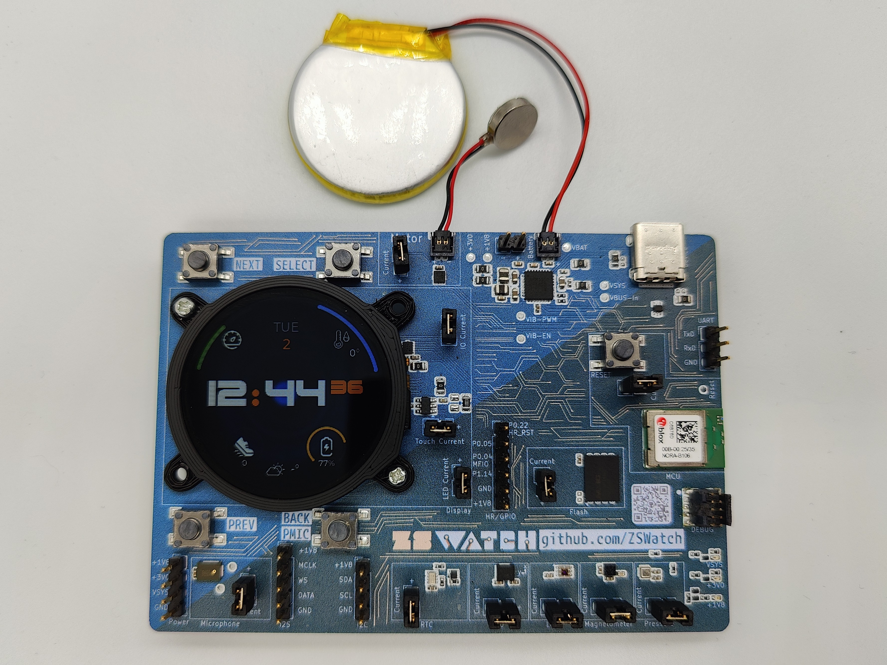

# WatchDK Quick Start



This guide walks you through setting up your **ZSWatch Development Kit (WatchDK)** for the first time - from powering on to having a fully working smartwatch UI with icons and images.

import Tabs from '@theme/Tabs';
import TabItem from '@theme/TabItem';

:::warning Known Issues from Early Shipments
- **Back button not working**: On some early DKs the RTC does not work reliably when powered from USB, which can cause the back button to stop responding. Latest firmware detects this at runtime and falls back automatically. See the [Battery & RTC Jumper](#battery--rtc-jumper) section for the required hardware config.

- **Production test firmware still running (bootloader not flashed):** If your watch does not boot into the normal ZSWatch UI and appears to be running test firmware, the bootloader may not have been programmed during production. If this is the case you need to follow the debugger instructions below.
- **Missing jumper:** Before starting, check that a jumper is present on the flash chip header (marked by the arrow tip in the image below). If it is missing, place a spare jumper there. If you do not have a spare, you can take the one from the vibration motor header. The vibration motor will stop working, but it is the least essential function.

  

**If you have any further issue or question please reach out to us on [Discord](https://discord.gg/8XfNBmDfbY) (preferred) or send an email to [mail@zswatch.dev](mailto:mail@zswatch.dev) and we will help you resolve it.**
:::

## What You Need

| Item | Required? | Notes |
|------|-----------|-------|
| **USB-C cable** | Yes | For power and optional USB firmware updates |
| **WatchDK** (with display & vibration motor connected) | Yes | Ships assembled and tested with display & motor pre-connected |
| **Debugger** (recommended: Nordic **nRF54L15 DK**, ~**$35**) | Strongly recommended | Needed if you want to develop the FW and flash via SWD instead of USB/BLE. A SEGGER J-Link works too, but is more expensive |
| **10-pin 1.27mm SWD cable** | Optional | Needed to connect the debugger to the WatchDK. Example cables: [Adafruit](https://www.adafruit.com/product/1675), [Amazon](https://www.amazon.com/Treedix-Ribbon-Connector-1-27mm-Connecting/dp/B09JK5HD3X) |
| **Battery** (LiPo) | Optional | The DK runs fine from USB power alone. See more at [Battery & RTC Jumper](#battery--rtc-jumper) section at the end |

## Optional: Debugger Setup (nRF54L15 DK)

If you plan to develop firmware or flash via SWD, connect a Nordic **nRF54L15 DK** as a debugger. For full wiring details (SWD cable, GND, UART log pin connections, and RTT alternative), see the **[Debugger Hardware Setup](../development/debugging.md#debugger-hardware-setup-nrf54l15-dk)** section in the Debugging guide.

## Step 1 - Power On

1. Connect the USB-C cable to the WatchDK.
2. The watch should boot into the ZSWatch UI.
3. Try pressing the top right button to open the application picker.

:::info No icons yet?
The watch ships with firmware but **without image resources**. The UI will work, but icons and graphics will be missing until you upload them in [Step 3](#step-3---upload-image-resources).
:::

:::warning Back button not responding?
Some DKs have an RTC power issue that can cause the back button to stop working when no battery is connected. See the [Battery & RTC Jumper](#battery--rtc-jumper) section for the fix.
:::

## Step 2 - Update Firmware

We recommend updating to the latest firmware as the first thing you do.

### Enable Updates on the Watch

Before any USB or BLE update, you must enable it on the watch:

1. On the watch, navigate to **Apps → Update**.
2. Set **USB** and/or **BLE** to **ON** depending on which method you plan to use.

### Choose Your Update Method

<Tabs>
  <TabItem value="web" label="Web Update (no debugger needed)" default>

  This method requires no extra hardware.

  1. Make sure you enabled USB or BLE updates on the watch (see above).
  2. Go to [zswatch.dev/update](https://zswatch.dev/update).
  3. Follow the on-screen instructions to flash via USB or BLE.

  For details on firmware files and other update methods, see [Firmware Updates](../firmware/firmware_updates.md).

  </TabItem>
  <TabItem value="debugger" label="Debugger (SWD)">

  Use this method if you have a debugger connected and want to flash via SWD.

  See [Firmware Updates](../firmware/firmware_updates.md) for the full SWD flashing steps (pre-built firmware and building from source).

  </TabItem>
</Tabs>

## Step 3 - Upload Image Resources

Many icons and images in the ZSWatch UI are stored in external flash and are **not** included in the firmware binary itself. They need to be uploaded separately. The image resources file (`lvgl_resources_raw.bin`) is included in the firmware download package, so you already have it.

The **easiest method** is the web updater, no debugger required:

1. On the watch, go to **Apps → Update** and enable **USB** and/or **BLE**.
2. Go to [zswatch.dev/update](https://zswatch.dev/update).
3. Follow the on-screen instructions to upload image resources via USB or BLE.

See the full [Image Resources](../development/image_resources.md) guide for more details.


:::tip Alternatively with debugger
If you have a debugger connected, you can upload images from VS Code by pressing `Ctrl+Shift+P` and running the task **Upload Raw FS**, or from the terminal:
```bash
west upload_fs --type raw --ini_file app/boards/zswatch/watchdk/support/qspi_mx25u51245.ini
```
Or directly using `nrfjprog`
```
nrfjprog -f nrf53 \
  --program lvgl_resources_raw.hex \
  --qspisectorerase --verify --reset \
  --qspiini app/boards/zswatch/watchdk/support/qspi_mx25u51245.ini \
  --coprocessor CP_APPLICATION
```
:::

## Step 4 - Done!

Your WatchDK should now be running the latest firmware with all icons and images visible. Navigate around the UI using the four buttons and the touchscreen.

If you want to view logs or debug the firmware, see the **[Debugging guide](../development/debugging.md)**, including how to connect the nRF54L15 DK for UART logs or use RTT.

## Battery & RTC Jumper

The board has a jumper that selects whether the real-time clock (RTC) is powered from USB (VSYS) or from a battery (VBAT). The two positions are shown below:


On some DKs the RTC does not work reliably in the USB/VSYS position. We believe the pull-up resistors on the RTC level shifter are sized for battery voltage rather than 5V USB, which causes inconsistent behavior across boards. If the back button does not respond, this is likely the cause.

:::tip Runtime fallback included
Current firmware automatically detects whether the RTC is available at runtime and falls back gracefully. A single firmware binary works on all boards regardless of RTC status, **but the jumper has to be placed correctly**.
:::

### Without a Battery

If you do not have a battery and the RTC is not working (back button unresponsive), remove the RTC jumper entirely or move it to the VBAT side. The firmware will automatically disable RTC-dependent features and continue using the software clock.

What you lose without RTC:
- **Timer and Alarm app** is disabled entirely.
- **Time will not advance while powered off** and drift after a power cycle until synced from a phone.
- All other features work normally.

### With a Battery

Connect a battery and move the RTC power jumper to the **VBAT** position. This gives the RTC a stable power source and all features work as expected.

### Suggested Batteries

Search for `JST RC 3.7V 1S` batteries and pick a suitable reseller. Battery size and capacity do not matter. Just make sure the connector matches the WatchDK 2-pin battery header:


## Next Steps

- **[Setting up the Development Toolchain](../development/toolchain.md)** - install VS Code, nRF Connect SDK, and build tools
- **[Compiling the Software](../development/compiling.md)** - build custom firmware from source
- **[Firmware Recovery](../firmware/firmware_recovery.md)** - if the watch becomes unresponsive
