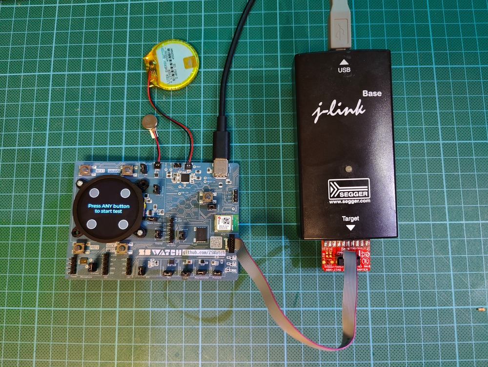

# WatchDK Production Testing Guide

This guide describes how to run the production test on the ZSWatch Development Kit (WatchDK) to verify that all hardware components are working correctly.

## Required Equipment

- **USB-C cable** – for power
- **J-Link debugger or Nordic nRF Dev Kit** (e.g., nRF54KL15DK) – for programming the device
- **ZSWatch Development kit (WatchDK)** – the device under test
- **Vibration motor** – must be connected to the WatchDK
- **Battery** – (TBD)

## Software Requirements

- [Segger J-Link Software](https://www.segger.com/downloads/jlink/)
- `nrfjprog` (part of [nRF Command Line Tools](https://www.nordicsemi.com/Products/Development-tools/nRF-Command-Line-Tools/Download?lang=en#infotabs))

## Hardware Setup

1. Connect the J-Link debugger to the WatchDK debug header
2. Connect the vibration motor to the designated connector
3. Connect USB-C cable for power

<div style={{padding: '0 20px'}}>



</div>

## Flashing the Test Firmware

Download the pre-built production test firmware or build it from source in `production_test/`.

Firmware can be downloaded from Github and is part of ci build artifacts:
`watchdk@1_nrf5340_cpuapp_debug/production_test_watchdk.hex`

Flash using nrfjprog:
```bash
nrfjprog --recover --coprocessor CP_NETWORK -f nrf53
nrfjprog --recover -f nrf53
nrfjprog --program production_test_watchdk.hex --chiperase --verify --reset -f nrf53
```

## Test Sequence

The production test runs automatically through the following tests in order. Each interactive test has a **15-second timeout**. The UI will guide you, but here is a short summary of what it does.

### Video Walkthrough

Watch a full run of the production test app to see the expected prompts and pacing before you start.

<div style={{position: 'relative', paddingBottom: '56.25%', height: 0, overflow: 'hidden', borderRadius: '12px', boxShadow: '0 8px 24px rgba(0,0,0,0.2)'}}>
  <iframe src="https://player.vimeo.com/video/1141434425?badge=0&amp;autopause=0&amp;player_id=0&amp;app_id=58479" style={{position: 'absolute', top: 0, left: 0, width: '100%', height: '100%'}} frameborder="0" allow="autoplay; fullscreen; picture-in-picture; clipboard-write; encrypted-media; web-share" referrerpolicy="strict-origin-when-cross-origin" title="WatchDK production test walk-through"></iframe>
</div>

Direct link to video: https://vimeo.com/1141434425

### 1. Button Test

- **Action:** Press all 4 buttons (top-left, top-right, bottom-left, bottom-right)
- **Pass criteria:** All buttons registered
- **Note:** The countdown timer starts after the first button press

### 2. Vibration Test

- **Action:** The vibration motor pulses repeatedly. Press any button if you feel it vibrating
- **Pass criteria:** User confirms vibration by pressing a button

### 3. Backlight Test

- **Action:** Press any button to start. The display brightness will cycle between low and high
- **Pass criteria:** Press any button to confirm the brightness changed visibly

### 4. Touch Test

- **Action:** Touch the display
- **Pass criteria:** Touch input detected

### 5. Microphone Test

- **Action:** Make some noise (speak, clap, tap near the microphone)
- **Pass criteria:** Audio activity detected above threshold

### 6. Sensor Scan (Automatic)

The following sensors are checked automatically at boot. Results are shown if any test failed.

### 7. Final Result

- Shows **PASS** (green) or **FAIL** (red) summary
- Displays count of passed vs total tests
- Press any button to reboot and run tests again

## Re-running Tests

Press any button on the final result screen to reboot and start a fresh test run.

## Post Test - Flashing ZSWatch Firmware

After a successful production test, flash the full ZSWatch firmware:

**Step 1:** Flash the app core (with QSPI configuration):
```bash
nrfjprog --program watchdk@1_nrf5340_cpuapp_debug.hex --chiperase --qspisectorerase --verify --reset --qspiini qspi_mx25u51245.ini --coprocessor CP_APPLICATION -f nrf53
```

**Step 2:** Flash the net core:
```bash
nrfjprog --program zswatch_nrf5340_CPUNET.hex --chiperase --verify --reset --coprocessor CP_NETWORK -f nrf53
```

### Full Expected Output

**Step 1 - Recover network core:**
```
$ nrfjprog --recover --coprocessor CP_NETWORK -f nrf53
Recovering device. This operation might take 30s.
Erasing user code and UICR flash areas.
Writing image to disable ap protect.
```

**Step 2 - Recover app core:**
```
$ nrfjprog --recover -f nrf53
Recovering device. This operation might take 30s.
Erasing user code and UICR flash areas.
Writing image to disable ap protect.
```

**Step 3 - Flash production test firmware:**

Now you would runt he production test sequence.
```
$ nrfjprog --program production_test_watchdk.hex --chiperase --verify --reset -f nrf53
[ #################### ]   0.352s | Erase file - Done erasing
[ #################### ]   2.994s | Program file - Done programming
[ #################### ]   3.003s | Verify file - Done verifying
Applying system reset.
Run.
```

**Step 1 - Flash net core image:**
```
$ nrfjprog --program zswatch_nrf5340_CPUNET.hex --chiperase --verify --reset --coprocessor CP_NETWORK -f nrf53
[ #################### ]   0.293s | Erase file - Done erasing
[ #################### ]   1.338s | Program file - Done programming
[ #################### ]   1.345s | Verify file - Done verifying
Applying system reset.
Run.
```

**Step 5 - Flash app core image:**
```
$ nrfjprog --program watchdk@1_nrf5340_cpuapp_debug.hex --chiperase --qspisectorerase --verify --reset --qspiini qspi_mx25u51245.ini --coprocessor CP_APPLICATION -f nrf53
[ #################### ]   0.000s | Erasing non-volatile memory - Erase successful
[ #################### ]   1.611s | Erase file - Done erasing
[ #################### ]  11.610s | Program file - Done programming
[ #################### ]  11.506s | Verify file - Done verifying
Applying system reset.
Run.
```
